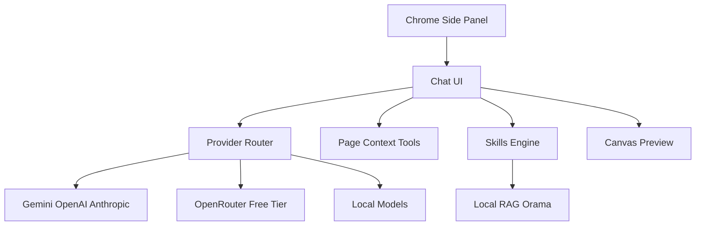

# Blueprint: savvops/nerdbot

_Auto-generated architectural documentation — 2026-09-24 (Phase 1). Built from the repository file tree, README and manifests._

## Diagram

## How it works

Nerdbot is a Chrome Manifest V3 side-panel AI assistant (v1.1.0, Apache-2.0). It lives in the browser sidebar and streams chat through a multi-provider router — Gemini, OpenAI, OpenRouter, Anthropic, plus local LM Studio and Ollama. The headline feature is free-by-default chat via OpenRouter's Free Models Router with one-click account connection, so users start at zero cost without pasting API keys.

The extension UI (`sidebar.html`, `src/`, built with Vite + TypeScript) offers chat history, message editing, pinned messages, and themes. Page-context tools inject the active tab, selected text, screenshots, or multi-tab content into the conversation. A skills engine runs built-in and custom skills with placeholder arguments; a local RAG knowledge base powered by Orama gives it memory over your own documents. Extras include voice input/output, image generation helpers, and a sandboxed HTML/CSS/JS canvas preview. Settings and keys stay in `chrome.storage.local` — nothing sensitive leaves the browser except to the provider you chose. A Convex backend and mobile/bridge shims round out the repo.

## Key files

- `manifest.json` / `sidebar.html` — MV3 extension shell and side-panel entry
- `src/` — TypeScript app: chat UI, provider router, skills, RAG
- `convex/` — backend for sync features
- `bridge/` / `mobile.html` — legacy bridge server and mobile surface
- `canvas.html` — sandboxed HTML/CSS/JS preview
- `docs/` — documentation; `CHROME_STORE.md` — store listing process
- `scripts/package-extension.mjs` — builds the shippable zip

## For the owner

Nerdbot is your AI assistant that lives in the browser sidebar — research, coding help, and page-aware chat without leaving the tab you're on. It is free to start (OpenRouter's free models), works with whatever AI provider you prefer, and keeps your keys on your own machine. This public repo is the engine; your personal skills and personas live in the private nerdbot-playbook overlay. It is also the planned home of the Blueprint feature — architecture diagrams for any repo, one click away.
